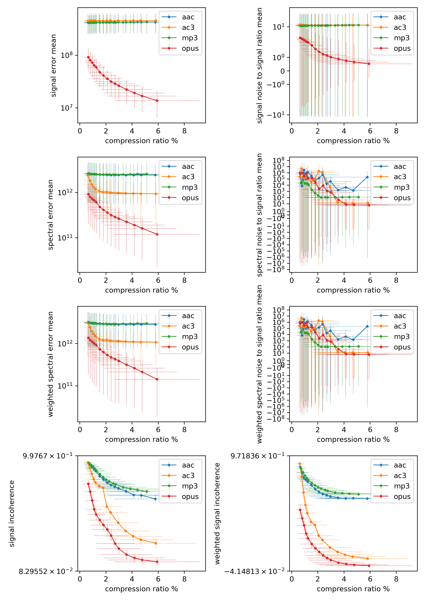

# Criteria

The tests have been run using, [`ffmpeg`](https://ffmpeg.org/) (4.4.2-1+b2 on Linux-x86_64).
- *Format*: The format used to generate encoded from the original
- *Spec*: Name of the set of parameters used to generate encoded from the original
- *Compression Ratio (%)*: `encoded_matroska_file_size / original_wav_file_size`
- *Hash perfect*: `encoded_array_hash == original_array_hash`
- *Encoding time (s)*: time to convert one second of original (wav) to encoded (matroska)
- *Decoding time (s)*: time to convert one second of encoded (matroska) to decoded (wav)
- *Signal Error (db)*: `20 * log10(mean(abs(endoded - original)))` (lower is better)
- *Signal Noise-to-Signal Ratio (db)*: `10 * log10(mean((decoded - original) / original))` (lower is better)
- *Spectral Error (db)*: `20 * log10(mean(abs(power_spectro(decoded, decoded_samplerate) - power_spectro(original, original_samplerate))))` (lower is better)
- *Weighted Spectral Error (db)*: Same as Spectral Error but the spectrogram is weighted with iso226_weigh_power_spectro (lower is better)
- *Spectral Noise-to-Signal Ratio (db)*: `10 * log10(mean((power_spectro(decoded, decoded_samplerate) - power_spectro(original, original_samplerate)) / power_spectro(original, original_samplerate)))` (lower is better)
- *Weighted Spectral Noise-to-Signal Ratio (db)*: Same as Spectral Noise-to-Signal Ratio but the spectrogram is weighted with iso226_weigh_power_spectro (lower is better)
- *Signal Incoherence*: `1 - mean(coherence(original, decoded, original_samplerate))` (lower is better)
- *Weighted Signal Incoherence*: Same as Signal Incoherence but the coherence is weighted with iso226_weigh_signal_coherence (lower is better)
# Results

Results have format `mean (stdev)`

<table>
<tr>
	<th rowspan="2">Format</th>
	<th rowspan="2">Spec</th>
	<th rowspan="2">Compression Ratio (%)</th>
	<th rowspan="2">Hash perfect</th>
	<th rowspan="2">Encoding time (s)</th>
	<th rowspan="2">Decoding time (s)</th>
	<th rowspan="2">Signal Error (db)</th>
	<th rowspan="2">Signal Noise-to-Signal Ratio (db)</th>
	<th colspan="2">Spectral Error (db)</th>
	<th colspan="2">Spectral Noise-to-Signal Ratio (db)</th>
	<th colspan="2">Signal Incoherence</th>
</tr>
<tr>
	<th>linear</th>
	<th>weighted</th>
	<th>linear</th>
	<th>weighted</th>
	<th>linear</th>
	<th>weighted</th>
</tr>
<tr>
<td rowspan="15">aac</td>
	<td>32k</td>
	<td>0.639% (0.345)</td>
	<td>no</td>
	<td>0.029 (0.007)</td>
	<td>0.026 (0.012)</td>
	<td>171.699 (3.477)</td>
	<td>19.078 (3.265)</td>
	<td>122.906 (3.473)</td>
	<td>117.779 (3.395)</td>
	<td>6.318 (9.854)</td>
	<td>6.318 (9.854)</td>
	<td>0.943 (0.007)</td>
	<td>0.969 (0.003)</td>
<tr>
	<td>40k</td>
	<td>0.784% (0.423)</td>
	<td>no</td>
	<td>0.030 (0.007)</td>
	<td>0.026 (0.013)</td>
	<td>171.741 (3.477)</td>
	<td>19.172 (3.256)</td>
	<td>122.788 (3.474)</td>
	<td>117.585 (3.385)</td>
	<td>6.618 (8.031)</td>
	<td>6.618 (8.031)</td>
	<td>0.927 (0.008)</td>
	<td>0.956 (0.004)</td>
<tr>
	<td>48k</td>
	<td>0.933% (0.503)</td>
	<td>no</td>
	<td>0.031 (0.007)</td>
	<td>0.026 (0.012)</td>
	<td>171.781 (3.477)</td>
	<td>19.239 (3.248)</td>
	<td>122.772 (3.476)</td>
	<td>117.563 (3.384)</td>
	<td>8.583 (10.532)</td>
	<td>8.583 (10.532)</td>
	<td>0.908 (0.010)</td>
	<td>0.945 (0.006)</td>
<tr>
	<td>56k</td>
	<td>1.079% (0.582)</td>
	<td>no</td>
	<td>0.032 (0.007)</td>
	<td>0.025 (0.011)</td>
	<td>171.812 (3.474)</td>
	<td>19.321 (3.247)</td>
	<td>122.781 (3.481)</td>
	<td>117.574 (3.393)</td>
	<td>9.605 (9.971)</td>
	<td>9.605 (9.971)</td>
	<td>0.891 (0.013)</td>
	<td>0.942 (0.006)</td>
<tr>
	<td>64k</td>
	<td>1.224% (0.660)</td>
	<td>no</td>
	<td>0.032 (0.007)</td>
	<td>0.025 (0.011)</td>
	<td>171.825 (3.473)</td>
	<td>19.380 (3.246)</td>
	<td>122.743 (3.480)</td>
	<td>117.525 (3.385)</td>
	<td>10.647 (11.043)</td>
	<td>10.647 (11.043)</td>
	<td>0.875 (0.014)</td>
	<td>0.938 (0.006)</td>
<tr>
	<td>80k</td>
	<td>1.513% (0.816)</td>
	<td>no</td>
	<td>0.034 (0.007)</td>
	<td>0.025 (0.010)</td>
	<td>171.843 (3.470)</td>
	<td>19.421 (3.258)</td>
	<td>122.677 (3.482)</td>
	<td>117.438 (3.383)</td>
	<td>11.959 (10.572)</td>
	<td>11.959 (10.572)</td>
	<td>0.836 (0.020)</td>
	<td>0.930 (0.007)</td>
<tr>
	<td>96k</td>
	<td>1.802% (0.972)</td>
	<td>no</td>
	<td>0.035 (0.007)</td>
	<td>0.025 (0.010)</td>
	<td>171.851 (3.469)</td>
	<td>19.416 (3.262)</td>
	<td>122.614 (3.475)</td>
	<td>117.345 (3.370)</td>
	<td>12.057 (9.128)</td>
	<td>12.057 (9.128)</td>
	<td>0.809 (0.021)</td>
	<td>0.922 (0.006)</td>
<tr>
	<td>112k</td>
	<td>2.091% (1.127)</td>
	<td>no</td>
	<td>0.035 (0.008)</td>
	<td>0.024 (0.009)</td>
	<td>171.855 (3.469)</td>
	<td>19.395 (3.227)</td>
	<td>122.577 (3.473)</td>
	<td>117.285 (3.364)</td>
	<td>12.284 (8.950)</td>
	<td>12.284 (8.950)</td>
	<td>0.784 (0.024)</td>
	<td>0.916 (0.005)</td>
<tr>
	<td>128k</td>
	<td>2.381% (1.284)</td>
	<td>no</td>
	<td>0.036 (0.007)</td>
	<td>0.024 (0.009)</td>
	<td>171.860 (3.468)</td>
	<td>19.426 (3.244)</td>
	<td>122.556 (3.471)</td>
	<td>117.253 (3.359)</td>
	<td>12.112 (9.412)</td>
	<td>12.112 (9.412)</td>
	<td>0.765 (0.025)</td>
	<td>0.911 (0.005)</td>
<tr>
	<td>144k</td>
	<td>2.672% (1.443)</td>
	<td>no</td>
	<td>0.035 (0.007)</td>
	<td>0.025 (0.010)</td>
	<td>171.864 (3.468)</td>
	<td>19.433 (3.245)</td>
	<td>122.546 (3.471)</td>
	<td>117.235 (3.357)</td>
	<td>11.564 (7.637)</td>
	<td>11.564 (7.637)</td>
	<td>0.752 (0.024)</td>
	<td>0.908 (0.005)</td>
<tr>
	<td>160k</td>
	<td>2.961% (1.599)</td>
	<td>no</td>
	<td>0.035 (0.006)</td>
	<td>0.025 (0.009)</td>
	<td>171.868 (3.468)</td>
	<td>19.444 (3.241)</td>
	<td>122.542 (3.469)</td>
	<td>117.229 (3.356)</td>
	<td>11.776 (8.071)</td>
	<td>11.776 (8.071)</td>
	<td>0.737 (0.025)</td>
	<td>0.906 (0.005)</td>
<tr>
	<td>192k</td>
	<td>3.544% (1.915)</td>
	<td>no</td>
	<td>0.035 (0.007)</td>
	<td>0.024 (0.009)</td>
	<td>171.874 (3.468)</td>
	<td>19.468 (3.238)</td>
	<td>122.537 (3.469)</td>
	<td>117.223 (3.356)</td>
	<td>11.613 (6.655)</td>
	<td>11.613 (6.655)</td>
	<td>0.716 (0.025)</td>
	<td>0.903 (0.005)</td>
<tr>
	<td>224k</td>
	<td>4.127% (2.230)</td>
	<td>no</td>
	<td>0.037 (0.008)</td>
	<td>0.025 (0.010)</td>
	<td>171.881 (3.468)</td>
	<td>19.478 (3.239)</td>
	<td>122.539 (3.471)</td>
	<td>117.224 (3.357)</td>
	<td>12.216 (7.066)</td>
	<td>12.216 (7.066)</td>
	<td>0.686 (0.029)</td>
	<td>0.902 (0.005)</td>
<tr>
	<td>256k</td>
	<td>4.705% (2.543)</td>
	<td>no</td>
	<td>0.038 (0.008)</td>
	<td>0.025 (0.010)</td>
	<td>171.893 (3.469)</td>
	<td>19.497 (3.242)</td>
	<td>122.548 (3.471)</td>
	<td>117.233 (3.358)</td>
	<td>12.386 (6.595)</td>
	<td>12.386 (6.595)</td>
	<td>0.684 (0.030)</td>
	<td>0.902 (0.005)</td>
<tr>
	<td>320k</td>
	<td>5.786% (3.197)</td>
	<td>no</td>
	<td>0.041 (0.010)</td>
	<td>0.026 (0.010)</td>
	<td>171.899 (3.470)</td>
	<td>19.512 (3.237)</td>
	<td>122.554 (3.475)</td>
	<td>117.239 (3.359)</td>
	<td>14.467 (10.594)</td>
	<td>14.467 (10.594)</td>
	<td>0.655 (0.036)</td>
	<td>0.902 (0.004)</td>
</tr>
<tr>
<td rowspan="15">ac3</td>
	<td>32k</td>
	<td>0.612% (0.331)</td>
	<td>no</td>
	<td>0.022 (0.006)</td>
	<td>0.025 (0.011)</td>
	<td>172.213 (3.504)</td>
	<td>19.721 (3.469)</td>
	<td>122.368 (3.564)</td>
	<td>117.437 (3.527)</td>
	<td>12.655 (9.692)</td>
	<td>12.655 (9.692)</td>
	<td>0.943 (0.013)</td>
	<td>0.976 (0.006)</td>
<tr>
	<td>40k</td>
	<td>0.766% (0.413)</td>
	<td>no</td>
	<td>0.022 (0.006)</td>
	<td>0.025 (0.011)</td>
	<td>172.489 (3.494)</td>
	<td>19.768 (3.292)</td>
	<td>121.270 (3.593)</td>
	<td>116.406 (3.592)</td>
	<td>11.396 (10.456)</td>
	<td>11.396 (10.456)</td>
	<td>0.900 (0.018)</td>
	<td>0.948 (0.011)</td>
<tr>
	<td>48k</td>
	<td>0.910% (0.491)</td>
	<td>no</td>
	<td>0.022 (0.006)</td>
	<td>0.025 (0.009)</td>
	<td>172.435 (3.497)</td>
	<td>19.600 (3.321)</td>
	<td>120.402 (3.588)</td>
	<td>115.490 (3.583)</td>
	<td>9.961 (9.444)</td>
	<td>9.961 (9.444)</td>
	<td>0.854 (0.024)</td>
	<td>0.915 (0.013)</td>
<tr>
	<td>56k</td>
	<td>1.054% (0.569)</td>
	<td>no</td>
	<td>0.023 (0.006)</td>
	<td>0.025 (0.010)</td>
	<td>172.417 (3.502)</td>
	<td>19.533 (3.308)</td>
	<td>119.851 (3.573)</td>
	<td>114.835 (3.551)</td>
	<td>8.640 (9.107)</td>
	<td>8.640 (9.107)</td>
	<td>0.813 (0.024)</td>
	<td>0.888 (0.013)</td>
<tr>
	<td>64k</td>
	<td>1.198% (0.646)</td>
	<td>no</td>
	<td>0.023 (0.007)</td>
	<td>0.025 (0.009)</td>
	<td>172.405 (3.506)</td>
	<td>19.491 (3.303)</td>
	<td>119.457 (3.568)</td>
	<td>114.341 (3.528)</td>
	<td>7.621 (8.959)</td>
	<td>7.621 (8.959)</td>
	<td>0.784 (0.022)</td>
	<td>0.870 (0.012)</td>
<tr>
	<td>80k</td>
	<td>1.487% (0.802)</td>
	<td>no</td>
	<td>0.022 (0.006)</td>
	<td>0.024 (0.008)</td>
	<td>172.386 (3.506)</td>
	<td>19.463 (3.298)</td>
	<td>118.971 (3.552)</td>
	<td>113.739 (3.493)</td>
	<td>5.792 (7.887)</td>
	<td>5.792 (7.887)</td>
	<td>0.755 (0.020)</td>
	<td>0.852 (0.011)</td>
<tr>
	<td>96k</td>
	<td>1.776% (0.958)</td>
	<td>no</td>
	<td>0.023 (0.008)</td>
	<td>0.025 (0.009)</td>
	<td>172.378 (3.507)</td>
	<td>19.439 (3.293)</td>
	<td>118.770 (3.539)</td>
	<td>113.470 (3.472)</td>
	<td>4.498 (7.193)</td>
	<td>4.498 (7.193)</td>
	<td>0.744 (0.020)</td>
	<td>0.845 (0.010)</td>
<tr>
	<td>112k</td>
	<td>2.064% (1.113)</td>
	<td>no</td>
	<td>0.023 (0.006)</td>
	<td>0.025 (0.009)</td>
	<td>172.411 (3.505)</td>
	<td>19.524 (3.295)</td>
	<td>118.755 (3.539)</td>
	<td>113.476 (3.456)</td>
	<td>7.735 (9.054)</td>
	<td>7.735 (9.054)</td>
	<td>0.593 (0.043)</td>
	<td>0.822 (0.011)</td>
<tr>
	<td>128k</td>
	<td>2.353% (1.269)</td>
	<td>no</td>
	<td>0.023 (0.006)</td>
	<td>0.025 (0.010)</td>
	<td>172.408 (3.505)</td>
	<td>19.519 (3.289)</td>
	<td>118.646 (3.532)</td>
	<td>113.338 (3.443)</td>
	<td>7.675 (9.139)</td>
	<td>7.675 (9.139)</td>
	<td>0.547 (0.047)</td>
	<td>0.813 (0.012)</td>
<tr>
	<td>144k</td>
	<td>2.353% (1.269)</td>
	<td>no</td>
	<td>0.023 (0.005)</td>
	<td>0.025 (0.010)</td>
	<td>172.408 (3.505)</td>
	<td>19.519 (3.289)</td>
	<td>118.646 (3.532)</td>
	<td>113.338 (3.443)</td>
	<td>7.675 (9.139)</td>
	<td>7.675 (9.139)</td>
	<td>0.547 (0.047)</td>
	<td>0.813 (0.012)</td>
<tr>
	<td>160k</td>
	<td>2.930% (1.580)</td>
	<td>no</td>
	<td>0.024 (0.006)</td>
	<td>0.025 (0.009)</td>
	<td>172.412 (3.504)</td>
	<td>19.519 (3.289)</td>
	<td>118.568 (3.522)</td>
	<td>113.237 (3.423)</td>
	<td>7.539 (6.010)</td>
	<td>7.539 (6.010)</td>
	<td>0.466 (0.045)</td>
	<td>0.797 (0.010)</td>
<tr>
	<td>192k</td>
	<td>3.507% (1.891)</td>
	<td>no</td>
	<td>0.025 (0.012)</td>
	<td>0.025 (0.009)</td>
	<td>172.411 (3.504)</td>
	<td>19.516 (3.292)</td>
	<td>118.494 (3.518)</td>
	<td>113.133 (3.412)</td>
	<td>8.762 (3.159)</td>
	<td>8.762 (3.159)</td>
	<td>0.401 (0.051)</td>
	<td>0.787 (0.010)</td>
<tr>
	<td>224k</td>
	<td>4.084% (2.203)</td>
	<td>no</td>
	<td>0.025 (0.006)</td>
	<td>0.025 (0.009)</td>
	<td>172.410 (3.504)</td>
	<td>19.515 (3.293)</td>
	<td>118.453 (3.517)</td>
	<td>113.075 (3.406)</td>
	<td>8.092 (3.199)</td>
	<td>8.092 (3.199)</td>
	<td>0.359 (0.045)</td>
	<td>0.781 (0.009)</td>
<tr>
	<td>256k</td>
	<td>4.661% (2.514)</td>
	<td>no</td>
	<td>0.025 (0.008)</td>
	<td>0.025 (0.009)</td>
	<td>172.410 (3.504)</td>
	<td>19.512 (3.292)</td>
	<td>118.415 (3.514)</td>
	<td>113.027 (3.401)</td>
	<td>7.690 (3.269)</td>
	<td>7.690 (3.269)</td>
	<td>0.332 (0.046)</td>
	<td>0.777 (0.008)</td>
<tr>
	<td>320k</td>
	<td>5.815% (3.136)</td>
	<td>no</td>
	<td>0.024 (0.006)</td>
	<td>0.025 (0.010)</td>
	<td>172.409 (3.504)</td>
	<td>19.512 (3.298)</td>
	<td>118.387 (3.513)</td>
	<td>112.990 (3.399)</td>
	<td>7.671 (3.330)</td>
	<td>7.671 (3.330)</td>
	<td>0.303 (0.042)</td>
	<td>0.773 (0.008)</td>
</tr>
<tr>
<td rowspan="15">mp3</td>
	<td>32k</td>
	<td>0.714% (0.389)</td>
	<td>no</td>
	<td>0.079 (0.022)</td>
	<td>0.024 (0.010)</td>
	<td>171.619 (3.502)</td>
	<td>18.983 (3.229)</td>
	<td>122.840 (3.486)</td>
	<td>117.635 (3.400)</td>
	<td>6.146 (7.346)</td>
	<td>6.146 (7.346)</td>
	<td>0.939 (0.009)</td>
	<td>0.966 (0.006)</td>
<tr>
	<td>40k</td>
	<td>0.861% (0.468)</td>
	<td>no</td>
	<td>0.084 (0.025)</td>
	<td>0.026 (0.012)</td>
	<td>171.655 (3.501)</td>
	<td>19.046 (3.231)</td>
	<td>122.769 (3.489)</td>
	<td>117.530 (3.393)</td>
	<td>6.903 (7.773)</td>
	<td>6.903 (7.773)</td>
	<td>0.923 (0.012)</td>
	<td>0.957 (0.007)</td>
<tr>
	<td>48k</td>
	<td>1.001% (0.545)</td>
	<td>no</td>
	<td>0.083 (0.022)</td>
	<td>0.024 (0.009)</td>
	<td>171.672 (3.498)</td>
	<td>19.107 (3.232)</td>
	<td>122.731 (3.486)</td>
	<td>117.470 (3.384)</td>
	<td>7.334 (7.633)</td>
	<td>7.334 (7.633)</td>
	<td>0.913 (0.013)</td>
	<td>0.951 (0.006)</td>
<tr>
	<td>56k</td>
	<td>1.137% (0.620)</td>
	<td>no</td>
	<td>0.084 (0.022)</td>
	<td>0.025 (0.010)</td>
	<td>171.686 (3.500)</td>
	<td>19.139 (3.235)</td>
	<td>122.707 (3.488)</td>
	<td>117.437 (3.385)</td>
	<td>8.141 (7.875)</td>
	<td>8.141 (7.875)</td>
	<td>0.896 (0.016)</td>
	<td>0.946 (0.006)</td>
<tr>
	<td>64k</td>
	<td>1.273% (0.695)</td>
	<td>no</td>
	<td>0.086 (0.024)</td>
	<td>0.026 (0.010)</td>
	<td>171.697 (3.499)</td>
	<td>19.187 (3.237)</td>
	<td>122.690 (3.490)</td>
	<td>117.410 (3.382)</td>
	<td>8.607 (7.510)</td>
	<td>8.607 (7.510)</td>
	<td>0.880 (0.018)</td>
	<td>0.941 (0.006)</td>
<tr>
	<td>80k</td>
	<td>1.538% (0.846)</td>
	<td>no</td>
	<td>0.089 (0.025)</td>
	<td>0.024 (0.009)</td>
	<td>171.708 (3.498)</td>
	<td>19.203 (3.251)</td>
	<td>122.669 (3.489)</td>
	<td>117.380 (3.379)</td>
	<td>9.305 (6.661)</td>
	<td>9.305 (6.661)</td>
	<td>0.852 (0.020)</td>
	<td>0.935 (0.005)</td>
<tr>
	<td>96k</td>
	<td>1.783% (0.993)</td>
	<td>no</td>
	<td>0.088 (0.024)</td>
	<td>0.024 (0.008)</td>
	<td>171.717 (3.497)</td>
	<td>19.226 (3.247)</td>
	<td>122.663 (3.488)</td>
	<td>117.371 (3.377)</td>
	<td>10.116 (6.007)</td>
	<td>10.116 (6.007)</td>
	<td>0.828 (0.019)</td>
	<td>0.930 (0.005)</td>
<tr>
	<td>112k</td>
	<td>2.020% (1.130)</td>
	<td>no</td>
	<td>0.089 (0.023)</td>
	<td>0.024 (0.009)</td>
	<td>171.723 (3.497)</td>
	<td>19.251 (3.251)</td>
	<td>122.655 (3.487)</td>
	<td>117.359 (3.375)</td>
	<td>10.512 (5.608)</td>
	<td>10.512 (5.608)</td>
	<td>0.809 (0.017)</td>
	<td>0.926 (0.004)</td>
<tr>
	<td>128k</td>
	<td>2.251% (1.259)</td>
	<td>no</td>
	<td>0.094 (0.023)</td>
	<td>0.026 (0.010)</td>
	<td>171.726 (3.497)</td>
	<td>19.257 (3.256)</td>
	<td>122.648 (3.489)</td>
	<td>117.349 (3.376)</td>
	<td>10.714 (5.124)</td>
	<td>10.714 (5.124)</td>
	<td>0.794 (0.015)</td>
	<td>0.923 (0.004)</td>
<tr>
	<td>144k</td>
	<td>2.572% (1.438)</td>
	<td>no</td>
	<td>0.097 (0.025)</td>
	<td>0.026 (0.012)</td>
	<td>171.726 (3.496)</td>
	<td>19.283 (3.269)</td>
	<td>122.635 (3.489)</td>
	<td>117.331 (3.376)</td>
	<td>10.798 (5.138)</td>
	<td>10.798 (5.138)</td>
	<td>0.777 (0.016)</td>
	<td>0.919 (0.004)</td>
<tr>
	<td>160k</td>
	<td>2.757% (1.533)</td>
	<td>no</td>
	<td>0.101 (0.024)</td>
	<td>0.026 (0.010)</td>
	<td>171.727 (3.497)</td>
	<td>19.281 (3.278)</td>
	<td>122.631 (3.491)</td>
	<td>117.325 (3.376)</td>
	<td>10.803 (5.164)</td>
	<td>10.803 (5.164)</td>
	<td>0.770 (0.015)</td>
	<td>0.918 (0.004)</td>
<tr>
	<td>192k</td>
	<td>3.319% (1.833)</td>
	<td>no</td>
	<td>0.094 (0.027)</td>
	<td>0.026 (0.011)</td>
	<td>171.808 (3.491)</td>
	<td>19.431 (3.264)</td>
	<td>122.672 (3.489)</td>
	<td>117.367 (3.375)</td>
	<td>11.001 (5.071)</td>
	<td>11.001 (5.071)</td>
	<td>0.749 (0.016)</td>
	<td>0.914 (0.004)</td>
<tr>
	<td>224k</td>
	<td>3.866% (2.135)</td>
	<td>no</td>
	<td>0.098 (0.028)</td>
	<td>0.026 (0.011)</td>
	<td>171.849 (3.488)</td>
	<td>19.518 (3.264)</td>
	<td>122.701 (3.487)</td>
	<td>117.395 (3.373)</td>
	<td>11.267 (5.183)</td>
	<td>11.267 (5.183)</td>
	<td>0.735 (0.018)</td>
	<td>0.913 (0.004)</td>
<tr>
	<td>256k</td>
	<td>4.410% (2.442)</td>
	<td>no</td>
	<td>0.099 (0.028)</td>
	<td>0.026 (0.011)</td>
	<td>171.931 (3.483)</td>
	<td>19.690 (3.265)</td>
	<td>122.781 (3.486)</td>
	<td>117.472 (3.373)</td>
	<td>11.506 (5.122)</td>
	<td>11.506 (5.122)</td>
	<td>0.726 (0.019)</td>
	<td>0.912 (0.004)</td>
<tr>
	<td>320k</td>
	<td>5.122% (2.840)</td>
	<td>no</td>
	<td>0.110 (0.057)</td>
	<td>0.026 (0.012)</td>
	<td>171.931 (3.483)</td>
	<td>19.681 (3.266)</td>
	<td>122.778 (3.485)</td>
	<td>117.469 (3.372)</td>
	<td>11.789 (5.143)</td>
	<td>11.789 (5.143)</td>
	<td>0.713 (0.020)</td>
	<td>0.911 (0.004)</td>
</tr>
<tr>
<td rowspan="15">opus</td>
	<td>32k</td>
	<td>0.647% (0.353)</td>
	<td>no</td>
	<td>0.032 (0.006)</td>
	<td>0.025 (0.008)</td>
	<td>158.331 (4.128)</td>
	<td>8.598 (4.035)</td>
	<td>118.242 (3.604)</td>
	<td>113.749 (3.789)</td>
	<td>15.052 (9.360)</td>
	<td>15.052 (9.360)</td>
	<td>0.775 (0.032)</td>
	<td>0.877 (0.014)</td>
<tr>
	<td>40k</td>
	<td>0.799% (0.436)</td>
	<td>no</td>
	<td>0.032 (0.007)</td>
	<td>0.027 (0.009)</td>
	<td>157.146 (4.165)</td>
	<td>7.411 (4.054)</td>
	<td>117.657 (3.620)</td>
	<td>113.178 (3.811)</td>
	<td>14.471 (9.668)</td>
	<td>14.471 (9.668)</td>
	<td>0.711 (0.042)</td>
	<td>0.859 (0.015)</td>
<tr>
	<td>48k</td>
	<td>0.951% (0.519)</td>
	<td>no</td>
	<td>0.032 (0.007)</td>
	<td>0.027 (0.009)</td>
	<td>156.208 (4.199)</td>
	<td>6.515 (4.152)</td>
	<td>117.223 (3.636)</td>
	<td>112.758 (3.832)</td>
	<td>13.481 (9.162)</td>
	<td>13.481 (9.162)</td>
	<td>0.643 (0.045)</td>
	<td>0.844 (0.015)</td>
<tr>
	<td>56k</td>
	<td>1.101% (0.603)</td>
	<td>no</td>
	<td>0.031 (0.006)</td>
	<td>0.028 (0.012)</td>
	<td>155.194 (4.194)</td>
	<td>5.442 (4.011)</td>
	<td>116.866 (3.641)</td>
	<td>112.355 (3.842)</td>
	<td>13.116 (9.484)</td>
	<td>13.116 (9.484)</td>
	<td>0.574 (0.046)</td>
	<td>0.827 (0.014)</td>
<tr>
	<td>64k</td>
	<td>1.252% (0.686)</td>
	<td>no</td>
	<td>0.031 (0.006)</td>
	<td>0.027 (0.009)</td>
	<td>154.444 (4.193)</td>
	<td>4.864 (4.071)</td>
	<td>116.480 (3.644)</td>
	<td>111.958 (3.843)</td>
	<td>12.418 (8.981)</td>
	<td>12.418 (8.981)</td>
	<td>0.531 (0.046)</td>
	<td>0.816 (0.014)</td>
<tr>
	<td>80k</td>
	<td>1.532% (0.846)</td>
	<td>no</td>
	<td>0.032 (0.006)</td>
	<td>0.028 (0.011)</td>
	<td>152.528 (4.254)</td>
	<td>3.011 (4.194)</td>
	<td>115.396 (3.654)</td>
	<td>110.931 (3.852)</td>
	<td>11.522 (8.543)</td>
	<td>11.522 (8.543)</td>
	<td>0.488 (0.045)</td>
	<td>0.804 (0.012)</td>
<tr>
	<td>96k</td>
	<td>1.810% (1.003)</td>
	<td>no</td>
	<td>0.032 (0.006)</td>
	<td>0.028 (0.009)</td>
	<td>151.304 (4.266)</td>
	<td>1.664 (4.198)</td>
	<td>114.800 (3.651)</td>
	<td>110.288 (3.837)</td>
	<td>10.418 (7.571)</td>
	<td>10.418 (7.571)</td>
	<td>0.449 (0.044)</td>
	<td>0.795 (0.011)</td>
<tr>
	<td>112k</td>
	<td>2.102% (1.168)</td>
	<td>no</td>
	<td>0.033 (0.007)</td>
	<td>0.028 (0.008)</td>
	<td>150.070 (4.267)</td>
	<td>0.485 (4.184)</td>
	<td>114.164 (3.645)</td>
	<td>109.611 (3.826)</td>
	<td>9.739 (6.349)</td>
	<td>9.739 (6.349)</td>
	<td>0.413 (0.046)</td>
	<td>0.787 (0.010)</td>
<tr>
	<td>128k</td>
	<td>2.402% (1.332)</td>
	<td>no</td>
	<td>0.034 (0.007)</td>
	<td>0.028 (0.008)</td>
	<td>148.961 (4.334)</td>
	<td>-0.709 (4.206)</td>
	<td>113.597 (3.651)</td>
	<td>109.032 (3.837)</td>
	<td>8.680 (7.204)</td>
	<td>8.680 (7.204)</td>
	<td>0.364 (0.045)</td>
	<td>0.780 (0.010)</td>
<tr>
	<td>144k</td>
	<td>2.700% (1.494)</td>
	<td>no</td>
	<td>0.035 (0.008)</td>
	<td>0.029 (0.010)</td>
	<td>148.142 (4.360)</td>
	<td>-1.445 (4.307)</td>
	<td>113.203 (3.651)</td>
	<td>108.626 (3.839)</td>
	<td>6.856 (6.145)</td>
	<td>6.856 (6.145)</td>
	<td>0.301 (0.044)</td>
	<td>0.774 (0.009)</td>
<tr>
	<td>160k</td>
	<td>2.989% (1.659)</td>
	<td>no</td>
	<td>0.035 (0.008)</td>
	<td>0.029 (0.009)</td>
	<td>147.376 (4.333)</td>
	<td>-2.241 (4.158)</td>
	<td>112.816 (3.647)</td>
	<td>108.198 (3.821)</td>
	<td>5.654 (6.171)</td>
	<td>5.654 (6.171)</td>
	<td>0.261 (0.043)</td>
	<td>0.770 (0.009)</td>
<tr>
	<td>192k</td>
	<td>3.583% (1.987)</td>
	<td>no</td>
	<td>0.035 (0.008)</td>
	<td>0.029 (0.010)</td>
	<td>145.934 (4.335)</td>
	<td>-3.677 (4.266)</td>
	<td>112.115 (3.644)</td>
	<td>107.335 (3.789)</td>
	<td>3.496 (4.374)</td>
	<td>3.496 (4.374)</td>
	<td>0.213 (0.041)</td>
	<td>0.764 (0.009)</td>
<tr>
	<td>224k</td>
	<td>4.178% (2.316)</td>
	<td>no</td>
	<td>0.036 (0.008)</td>
	<td>0.031 (0.012)</td>
	<td>144.648 (4.346)</td>
	<td>-4.919 (4.166)</td>
	<td>111.425 (3.628)</td>
	<td>106.511 (3.768)</td>
	<td>1.741 (4.003)</td>
	<td>1.741 (4.003)</td>
	<td>0.187 (0.036)</td>
	<td>0.761 (0.008)</td>
<tr>
	<td>256k</td>
	<td>4.774% (2.646)</td>
	<td>no</td>
	<td>0.037 (0.008)</td>
	<td>0.030 (0.009)</td>
	<td>143.443 (4.491)</td>
	<td>-6.144 (4.288)</td>
	<td>110.664 (3.677)</td>
	<td>105.600 (3.791)</td>
	<td>0.335 (4.096)</td>
	<td>0.335 (4.096)</td>
	<td>0.172 (0.032)</td>
	<td>0.759 (0.008)</td>
<tr>
	<td>320k</td>
	<td>5.912% (3.265)</td>
	<td>no</td>
	<td>0.037 (0.008)</td>
	<td>0.030 (0.009)</td>
	<td>141.598 (4.608)</td>
	<td>-7.955 (4.370)</td>
	<td>109.313 (3.737)</td>
	<td>103.884 (3.770)</td>
	<td>-2.006 (4.003)</td>
	<td>-2.006 (4.003)</td>
	<td>0.156 (0.031)</td>
	<td>0.758 (0.008)</td>
</tr>
</table>

# Plotted results

